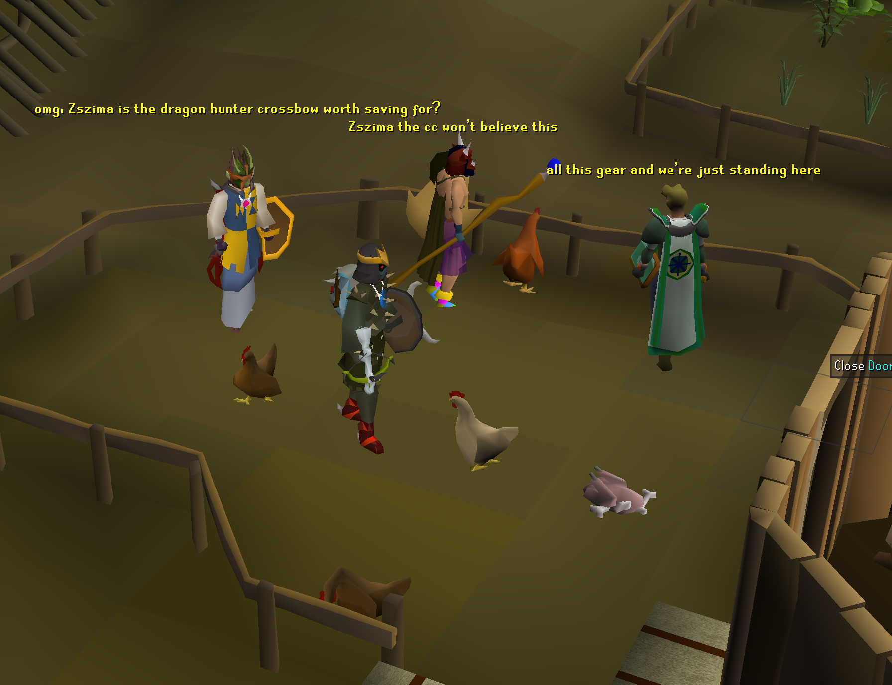
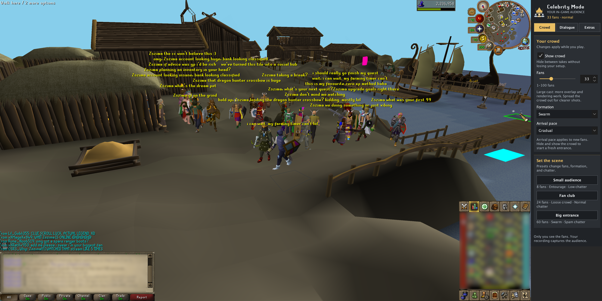

# Fame Simulator


Feel famous in Gielinor. Even if you’re just killing chickens.

Fame Simulator gives your OSRS character an overenthusiastic fan club. Up to 100 simulated fans follow you around, comment on what you’re doing, cheer your levels, and have far too much to say about your gear. Turn on fan PMs for an inbox full of people asking whether it’s really you. It’s a little taste of RuneScape fame while you bank, skill, fight, or wander around.

The fans and their messages are cosmetic and visible only in your client. Other players won’t see them, and the plugin never sends messages to anyone.

## Your own fan club

- **Take an entourage everywhere.** Keep a few loyal followers or surround yourself with up to 100 fans. They arrive gradually, follow your route, gather when you stop, and occasionally wave or cheer.
- **Get hyped up for ordinary things.** Fans comment on banking, combat targets, your weapon, and recent skilling. They celebrate levels and react when you die. Apparently, your next bank trip is a big deal.
- **Experience the inbox chaos.** Optional simulated incoming fan PMs range from occasional messages to hundreds per minute in the native private-chat display.
- **Choose your kind of fame.** Pick outfits, formations, optional usernames, and chatter from occasional comments to everyone shouting over each other.
- **Give fans your own jokes.** Add catchphrases or running jokes, use only your custom lines, or mix them with built-in chatter.

Want a crowd that hypes up your Slayer trip or treats your bank organisation like a public event? That’s the idea. You can also use the fans for a fake celebrity encounter, an OSRS video bit, or a stream gag: recordings and streams that capture your RuneLite game view capture the crowd too.

## Get famous

Enable **Fame Simulator** in RuneLite, then click the gold **crown icon** in the sidebar.

1. In **Crowd**, choose 1–100 fans, a formation, and an arrival pace—or try a crowd preset. Use **Show crowd** to hide or show your fan club without losing your settings.
2. In **Extras**, choose outfits, fan names, personal space, and travelling spread.
3. In **Dialogue**, choose how often fans talk. **Low** gives you individual comments, **Normal** makes a busy crowd, and **Spam** has everyone shouting over each other. Built-in chatter works without writing any lines yourself.
4. For the full celebrity experience, enable **Fan PMs** in **Dialogue → Fan inbox** and choose a traffic intensity.

Crowd controls save as you change them. The regular RuneLite settings remain available and stay in sync with the sidebar.

## Give your followers something to say

For your own jokes or creator bits, choose **My lines only** in **Dialogue**, or **Built-in + my lines** to keep the automatic commentary too. Paste one quote per line and click **Save lines**. Placeholder buttons insert character, gear, target, and skill references.

Quote edits stay as a draft until you save; **Revert** reloads the saved lines.

For example:

```text
{player} can we get a bank tour
all this gear just to forget a teleport
{player} brought the {gear}. we're saved
{target} can we get an autograph after this
i was here before the first 99
```

Quotes are chosen from your pool automatically. You can change the pool and other settings while the plugin is running, so swap in jokes whenever you like. Custom quotes aren't assigned to particular activities or triggered on cue.

| Placeholder | Replaced with |
| --- | --- |
| `{player}` | Your character’s current name |
| `{gear}` | Your equipped weapon’s name; `fit` when unavailable |
| `{target}` | Your current combat target; `opponent` when unavailable |
| `{skill}` | The recently observed skill; `skill` when unavailable |
| `{level}` | The level associated with the current skill context; `0` when unavailable |

Use one quote per line if your dialogue contains commas. A single line can also use commas to separate quotes. The plugin accepts up to 100 quotes, strips markup, and limits each displayed line to 100 characters, including substituted names.

## Reactions that follow what you’re doing

Built-in dialogue uses your character’s current activity to pick its subject. Open the bank and fans talk about supplies, gear setups, and bank tabs. Fight a monster and they can name the target. Switch weapons and someone may notice. Gain skill XP and the conversation can shift to that skill. Level reactions name the actual skill and level.

The dialogue combines hundreds of patterns with personality-specific wording and remembers recent lines to reduce repetition. That gives you spontaneous commentary while you play, alongside any custom jokes you add.

Bank chatter currently detects an open bank interface; it does not identify the bank’s location. Gear comments refer to your equipped weapon. You can write location-specific lines into your custom quote pool for your favourite bank.

## Fan inbox

In **Dialogue → Fan inbox**, enable **Fan PMs** to simulate an incoming flood of direct messages. Fictional senders hype you up, ask for GP or clan visits, act like old friends, or wonder whether it’s really you. Small templates combine greetings, bosses, items, clan names, requests, and slang to keep the inbox varied.

| Traffic intensity | Target average |
| --- | --- |
| Relaxed | ~20 PMs/min |
| Streamer | ~80 PMs/min |
| Global Celebrity | ~180 PMs/min |
| Peak World Record | ~360 PMs/min |

Arrivals are randomized, with natural clumps and lulls. PMs run independently of **Show crowd**, overhead chat frequency, and your custom quote pool. They start only while logged in; turning the feature off stops traffic and discards pending messages.

Messages use native incoming private chat, so the client controls the split-chat display, private-chat tab, colours, timestamps, transparency, and filtering. The plugin leaves your client settings alone. Sender names are plain: randomized badges are omitted because there is no standard configuration toggle for them. Other plugins may handle these local PMs as normal chat, including chat notifications or history.

**Play native notification sound** is optional and defaults to off. It uses the native UI sound at most once every two seconds and respects sound-effect volume and mute settings. Under load, pending traffic is capped and stale messages are dropped rather than replayed in a huge catch-up burst.

## Screenshots

Even the chicken pen gets an audience:



A larger crowd, the fan club controls, and incoming fan PMs in split chat (shown under the earlier Celebrity Mode name):



## Your fan club controls

The sidebar keeps crowd setup, dialogue, and appearance in three tabs, with a summary of the configured crowd and chatter at the top. Quick crowd presets set fans, formation, and frequency while keeping your quotes and appearance choices.

## Settings at a glance

| Setting | Default | What it does |
| --- | --- | --- |
| Crowd size | 8 | Choose 1–100 fans; new fans use your chosen arrival pace |
| Show crowd | On | Hide or show the fans without losing settings |
| Arrival pace | Gradual | Gradual, Quick, or Instant; applies to new arrivals |
| Formation | Entourage | Travel as an Entourage, Trail, Loose Crowd, or Swarm; all gather around you when stopped |
| Personal space | On | Prefer separate tiles; large stopped crowds gather over a wider area |
| Maximum spread | 2 | Set travelling spread from 1–8 tiles |
| Gear theme | Mixed | Choose Bob, bronze, F2P, midgame, fashionscape, modern gear, or mixed outfits |
| Show fan names | Off | Show simulated usernames above fans |
| Chat frequency | Spam | Off, Low, Normal, or Spam |
| Custom quotes | Empty | Add your own overhead dialogue |
| Quote source | Mixed | Built-in dialogue, custom quotes, or both; an empty custom-only pool is silent |
| React to events | On | Enable recognition, level and death reactions, and occasional stationary emotes |
| Enable fan PMs | Off | Simulate incoming messages in native private chat |
| Traffic intensity | Relaxed | Approximately 20, 80, 180, or 360 PMs/min |
| Play native notification sound | Off | Native UI sound, throttled to once per two seconds |
| Debug overlay | Off | Show movement diagnostics for development |

**Chat frequency: Off** disables all overhead dialogue, including event reactions. **React to events** controls event reactions and emotes; activity-aware built-in chatter follows **Quote source** and **Chat frequency**. In `CUSTOM_ONLY` mode, event dialogue also comes from your custom pool. Names are controlled separately.

## Installation

Open RuneLite’s **Plugin Hub**, search for **Fame Simulator**, and click **Install**. If you still see **Celebrity Mode**, the rename is awaiting RuneLite maintainer review. Existing users receive the rename through the usual Hub update.

To run it locally for development, use JDK 17 and the checked-in Gradle wrapper:

```sh
./gradlew clean test jar
./gradlew run
```

The developer launcher opens RuneLite with the plugin loaded. Log in and enable **Fame Simulator** in the plugin panel.

See [development notes](docs/development.md) for build details, implementation, test coverage, and the remaining checks in a logged-in client.

## What to expect

Larger crowds can overlap and cost more to render. Start small and increase the count to suit your taste and hardware.

Fans cannot interact with the game or control your character. The plugin makes no network requests and includes no telemetry. Outfits currently use male body kits. Valuable-drop reactions are not implemented.

The screenshots above show the plugin running in a logged-in client, including the sidebar and split-chat fan PMs. Full transition, rendering, and performance checks remain; see the [live-check checklist](docs/development.md#verification-and-remaining-live-checks).

## License

MIT; see [LICENSE](LICENSE).
